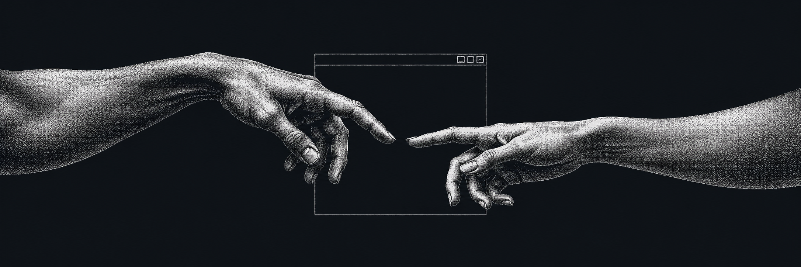
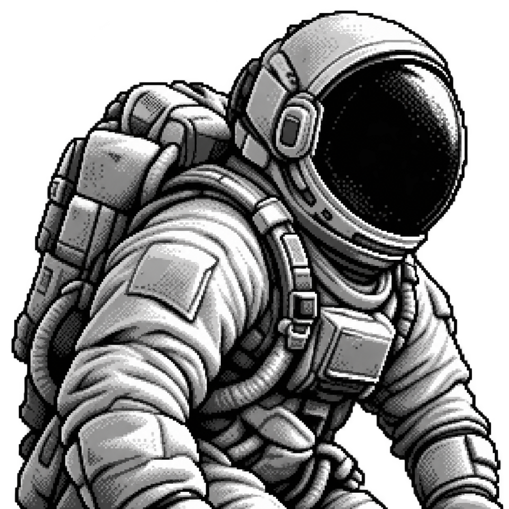

<!-- Profilo di Carlo · Serpe-hume. Nessun dato personale o statistica aggiunto senza una fonte. -->

  

<h1 align="center">Ciao 👋, sono Carlo</h1>
<h3 align="center">Informatica &amp; Cybersecurity</h3>

<samp>Code. Learn. Secure.</samp>

 

Sviluppo software, esplorazione delle reti e curiosità per la sicurezza informatica.

<h2 align="center">🚀 About Me</h2>

Sono <strong>Carlo</strong>, su GitHub <strong>Serpe-hume</strong>. Mi interessano l'informatica, lo sviluppo software e la cybersecurity.

I miei progetti spaziano dalla <strong>gestione del magazzino</strong> alle <strong>interfacce web</strong>, dagli strumenti di <strong>subnetting</strong> ai <strong>giochi</strong>.

Nei repository utilizzo <strong>Dart e Flutter</strong>, <strong>HTML, CSS e JavaScript</strong> e <strong>C#</strong>: tecnologie diverse per esplorare applicazioni e idee.

Voglio approfondire la <strong>sicurezza informatica</strong>, le <strong>reti</strong> e il funzionamento dei sistemi, continuando a imparare attraverso progetti concreti.

 

<h2 align="center">🤝 Connect</h2>

  

<h2 align="center">💻 Tech Stack</h2>

  

Tecnologie e piattaforme presenti nei miei progetti.

<!-- Il calendario dei contributi con i quadratini viene mostrato e aggiornato direttamente da GitHub sotto il README del profilo. -->
